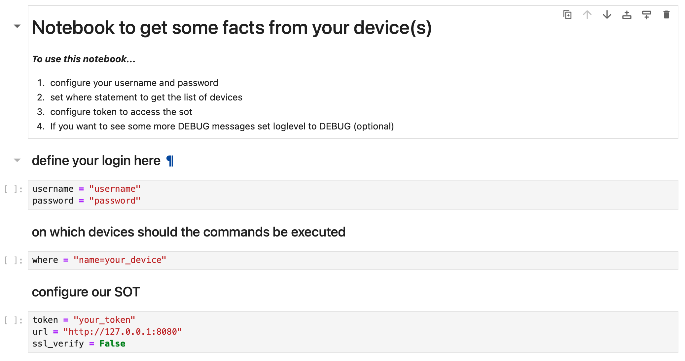

#############
Jupyter Argon
#############

Argon makes it easy for you to gather some facts from your devices.

Brief overview
**************

Do you know the situation: You just want to get some information from a few devices and 
it drags on like rubber? Argon makes it very easy to gather informations. 

The Notebook
************

You need your username and your password as well the URL, and the Token of nautobot.
By configuring the 'where' variable, you define the list of devices on which the commands 
are executed.

There are currently four different sections containing ten different commands. 

These are:

    General facts:

        - show hostname, software, hardware, serial, and uptime
        - show cdp neighbors
        - show OSPF neighbors
        - show ip int brief
        - SNMP user
    
    Routing:

        - show ip route
    
    ARP:

        - show interfaces
        - show ip interface brief
        - show interfaces description