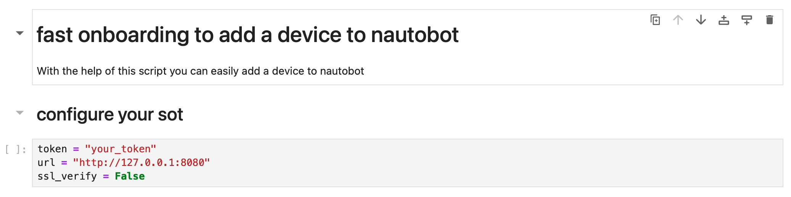
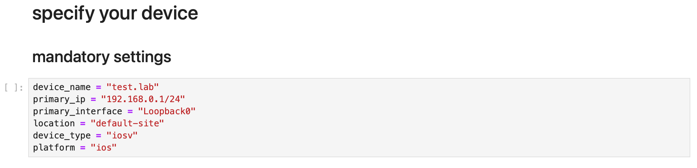
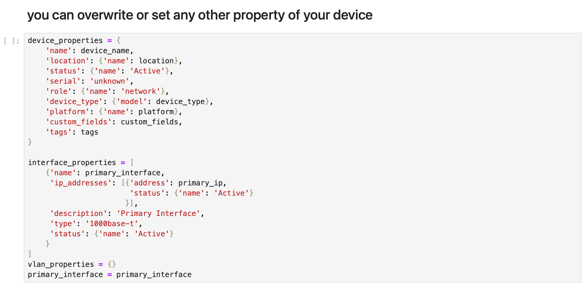

#######################
Jupyter Fast Onboarding
#######################

There is a Jupyter Notebook to make it easier to onboard devices.

Brief overview
**************

Please fasten your seatbelt!

This is the fastest way to onboard a device. Just configure how to access nautobot specify the device and
run the Notebook.

The Notebook
************

You need the URL, and the Token to access nautobot.

Configure your device

Run the Notebook
