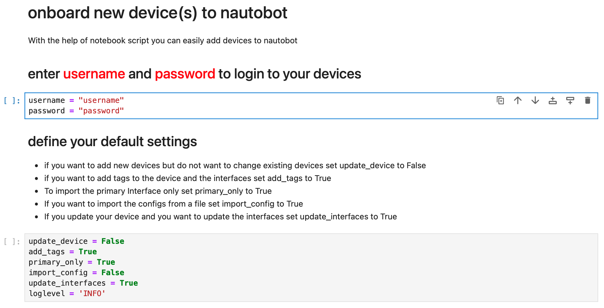
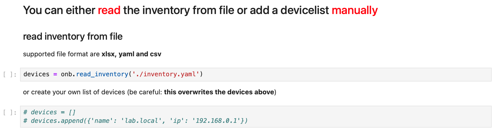

##################
Jupyter Onboarding
##################

There is a Jupyter Notebook to make it easier to onboard devices.

Brief overview
**************

Jupyter Notebooks are a fancy way to onboard devices even if you have no experience with Python.
Of cause you need Jupyter installed. Using the notebook is simple. All you have to do is 
configure your username and password and add all the devices you want to onboard to the inventory.

The Notebook
************

First of all you must configure username and password and change the default settings to your need. 
The parameters are based on the miniApp 'onboarding' and should be 'self-explanatory'.

By default, the inventory is read from the file inventory.yaml. Open this file with the notebook and 
add the devices that you want to onboard. Alternatively, you can also adjust the 'devices' list manually.
Last but not least, the 'Primary Interface' must be adjusted if you have set 'primary_only = True'.

That's it. Run the Notebook and check if the Device was onboarded.
