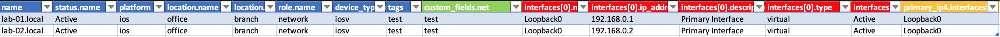
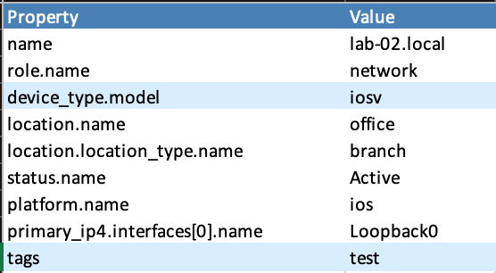
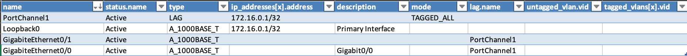
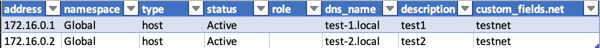

######
Kobold
######

.. contents::

Brief overview
**************
Kobold is a miniApp to export, import, update and transform device properties. 

Examples of the use of this app are:
  - import nautobot "default" values like locations, roles or device types
  - import devices using xlsx files or json (hldm)
  - exporting devices to json (hldm) or xlsx files
  - updating device properties
  - transforming device properties like location or names

Let it run
**********

.. code-block:: shell

      usage: kobold.py [-h] [--loglevel LOGLEVEL] [--loghandler LOGHANDLER] [--uuid UUID] 
                       [--config CONFIG] [--debug-veritas] {update,export,import,transform} ...

      positional arguments:
        {update,export,import,transform}
          update              update devices
          export              export data of devices
          import              import data to nautobot
          transform           transform properties of devices

      options:
        -h, --help            show this help message and exit
        --loglevel LOGLEVEL   used loglevel
        --loghandler LOGHANDLER
                              used log handler
        --uuid UUID           database logger uuid
        --config CONFIG       updater config file
        --debug-veritas       enable veritas debug logging

Options for all commands
************************

You can set the loglevel, loghandler, the UUID for all the commands. If you want to see debug
messages of the veritas lib add --debug-veritas at the beginning.

The syntax is:

.. code-block:: shell

    >>> ./kobold --loglevel debug [--debug-veritas] {update,export,transform} ....

You must write these three parameters at **the beginning** of the command.

Exporter
********
To export device properties, configs, facts or the HLDM use the exporter. 

.. code-block:: shell

    usage: kobold.py export [-h] --playbook PLAYBOOK --job JOB [--profile PROFILE] 
                            [--username USERNAME] [--password PASSWORD]

    options:
      -h, --help           show this help message and exit
      --playbook PLAYBOOK  playbook config to use
      --job JOB            job to run
      --profile PROFILE    profile to get login credentials
      --username USERNAME  login username
      --password PASSWORD  login password

To start a job, you must specify the name of the job. To use the exporter you have to write a playbook. 
A playbook has the following structure:

.. code-block:: yaml

      ---
      jobs:
        - job: export_properties
          description: export properties
          devices:
            sql:
              # the values of the select statement must include the columns you want to export
              select: id, name, primary_ip4
              from: nb.devices
              where: name__ic=local
          tasks:
            - export: 
              - content: properties
                header: True
                columns: id, name, primary_ip4.address, primary_ip4.interfaces.name, checksum
                format: excel
                filename: ./export/properties.xlsx

The parameter 'content' specifies what to do. It is either 'properties', 'config', 'facts' or 'hldm'.
The two jobs 'config' and 'facts' require either a profile or a username/password because these two 
jobs have to log on to the devices.

You can export a device to a xlsx file using "content: device_to_xlsx". However, the corresponding 
playbook looks a little different and is described below.

Export device properties
========================

Using the playbook above, the miniApp exports the **device properties**

  - id
  - name
  - primary_ip4.address (the primary IP Address)
  - primary_ip4.interfaces.name (the name of the primary interface)
  - checksum (md5 hash of the former columns)

and writes the data to a xlsx file named './export/properties.xlsx'. The result looks like this:

.. code-block:: shell

    ./kobold.py export --profile default --playbook playbooks/export.yaml --job export_properties

.. image:: ./kobold_export.png
  :width: 700
  :alt: Kobold export

You can then modify the data and reimport it using the kobold updater.

Export the HLDM
===============
To export the HLDM of devices use this playbook:

.. code-block:: yaml

    - job: export_hldm
      description: export HLDM
      devices:
        sql:
          select: name
          from: nb.devices
          where: name=lab.local
      tasks:
        - export:
          - content: hldm
            directory: hldm/__location.name__
            filename: __name__.json

And then use this command:

.. code-block:: shell

    ./kobold.py export --profile default --playbook playbooks/export.yaml --job export_hldm
    2024-02-04 16:40:20 | INFO | unset | starting job export_hldm / export HLDM
    2024-02-04 16:40:20 | INFO | unset | exporting [{'content': 'hldm', 'directory': 'hldm/__cf_net__/__location.name__', 'filename': '__name__.json'}]

Export a device to a xlsx sheet
===============================
You can use the kobold to export a device to an Excel sheet.

.. code-block:: shell

    ./kobold.py export --playbook playbooks/export_device.yaml --job device_to_xlsx

Which data is exported can be configured in the playbook.

.. code-block:: shell

      ---
      jobs:
        - job: device_to_xlsx
          description: export devices to xlsx file
          devices:
            sql:
              # the values of the select statement must correspond to the mapping
              select: name, role, device_type, serial, asset_tag, location, rack, face, position, vrfs, status, platform, primary_ip4, custom_fields, tags, interfaces 
              from: nb.devices
              where: name__ic=local
          tasks:
            - export: 
              - content: device_to_xlsx
                filename: ./export/__name__.xlsx
                columns:
                  device:
                    - name
                    - role.name
                    - device_type.model
                    - serial
                    - asset_tag
                    - location.name
                    - location.location_type.name
                    - rack.name
                    - rack.rack_group.name
                    - face
                    - position
                    - vrfs
                    - status.name
                    - platform.name
                    - primary_ip4.interfaces[0].name
                    - custom_fields.net
                    - custom_fields.snmp_credentials
                    - tags
                  interfaces:
                    - name
                    - status.name
                    - type
                    - ip_addresses[x].address
                    - description
                    - mode
                    - lag.name
                    - untagged_vlan.vid
                    - tagged_vlans[x].vid
                colors:
                  header: 004c81ba
                  header_font: FFFFFF
                  default: 00FFFFFF
                  name: 00FFFFFF
                  role.name: 00FFFFFF
                  device_type.model: 00D9EEFF
                  serial: 00D9EEFF
                  asset_tag: 00D9EEFF
                  location.name: 00FFFFFF
                  location.location_type.name: 00FFFFFF
                  rack.name: 00FFFFFF
                  rack.rack_group.name: 00FFFFFF
                  face: 00FFFFFF
                  position: 00FFFFFF
                  vrfs: 00D9EEFF
                  status.name: 00FFFFFF
                  platform.name: 00FFFFFF
                  primary_ip4.interfaces[0].name: 00FFFFFF
                  custom_fields.net: 00D9EEFF
                  custom_fields.snmp_credentials: 00D9EEFF
                  tags: 00D9EEFF

Updater
*******
With the help of the updater you can:

  - import data that was exported (and maybe modified)
  - update device properties
  - transform device properties (upper case device names etc.)

.. code-block:: shell

      usage: kobold.py update [-h] --filename FILENAME [--job JOB] [--where WHERE] 
                              [--force] [--dry-run] [--add-missing-data]

      options:
        -h, --help           show this help message and exit
        --filename FILENAME  name of file to update data
        --job JOB            job to run
        --where WHERE        overwrite where statement
        --force              force bulk updates even if checksum equals
        --dry-run            print updates only
        --add-missing-data   add missing data if possible (eg. IP-address)

Update devices using csv or xlsx files
======================================
To update some device data that was exported and modified before, use this command:

.. code-block:: shell

    ./kobold.py update --filename export/properties.xlsx [--add-missing-data] [--dry-run]
  
This updates the data. If you change the primary interface and the primary IP address and 
these are not yet in the IPAM, the --add-missing-data parameter must be added.

Update device properties or set tags
====================================
The miniApp directory contains several examples. In ./kobold/updates/ you find examples to:

  - set, add, or delete device tags
  - set, add, or delete interface tags
  - update device properties
  - update device properties using the IP-Address of the device (and not the name)
  - update interface properties

Let's have a look at one example:

.. code-block:: yaml

      ---
      update:
        - job: update_device_property
          description: Set device property
          source:
            select: name
            from: nb.devices
            where: name__ic=local
          tasks:
            - device_property:
                serial: my_new_serial
                status: {'name': 'Active'}
                custom_fields: {'net': 'my_net'}

Each job consists of a job identifier, a description (optional), a source and the tasks. 

.. tip::

  To get the list of devices use:

    .. code-block:: yaml

      devices:
          select: name, interfaces
          from: nb.devices
          where: name=lab-01.zz and interfaces_name=Loopback0
      
    where 
      - 'select' specifies what properties to get
      - 'from' the name of the 'nautobot module' and
      - 'where' a SQL-like statement what devices to get.

  Using --where as an argument overwrites the configured where statement! 

You can set device properties by using 'device_property' as task. Have a look at the next example to see 
how to set, add or delete a tag.

.. code-block:: yaml

    tasks:
      - delete_tag:
          scope: dcim.device
          tag: test
      - add_tag:
          scope: dcim.device
          tag: test2
      - set_tag:
          scope: dcim.device
          tag: test

To update an interface, look at this example:

.. code-block:: yaml

      ---
      update:
        - job: update_device_property
          description: Set device property
          source:
            select: name, interfaces
            from: nb.devices
            where: name__ic=local and interfaces_name=Loopback0
          tasks:
            - interface_property:
                status: {'name': 'Active'}

This sets the status of all interfaces to 'Active' whose device has the word local in its name.

Write your own plugins to update device properties
==================================================
You can write your own plugins to update device properties. The plugin must be in the ./kobold/plugins directory.
To use your plugin you have to add the path and the name of the plugin to the configuration file. 
The configuration have the following structure:

.. code-block:: yaml

    ---
    update:
      - job: update_snmp_credentials
        description: Checks whether the SNMP credentials are working and updates the snmp_credentials field.
        devices:
          select: name, primary_ip4, platform, cf_snmp_credentials
          from: nb.devices
          where: name=lab-04.local
        tasks:
          - mode: advanced
            # plugin to import
            plugin_dir: plugins
            plugin: check_snmp
            # call is the name of the registered method
            call: check_snmp_credentials
            # type can be autonomous, set_value
            type: autonomous
            # all arguments are passed to your method
            arguments:
              threads: 5
              update: true
              use: None
              repo_name: sot_data
              repo_apth: /Users/marc/Programming/veritas/veritasData/
              repo_filename: defaults/credentials.yaml

There are two types of plugins: autonomous and set_value. The first type is used when you want full control
of your code. The second type is used when you want the kobold app to set a value to a property. In this case
you have to return the value.

To add the method part of the kobold app you have to add the following code to your plugin:

.. code-block:: python

    from veritas.plugin import kobold

    @kobold("your_name_of_the_plugin") # check_snmp_credentials in the above example
    def your_method(self, **kwargs):
        # your code

        # in case of type set_value
        return "your_new_value"

Transformer
***********
To transform some device properties use the transform command.

.. code-block:: shell

      usage: kobold.py transform [-h] --filename FILENAME [--job JOB] [--where WHERE] 
                                 [--template TEMPLATE] [--dry-run]

      options:
        -h, --help           show this help message and exit
        --filename FILENAME  name of file to transform data
        --job JOB            job to run
        --where WHERE        overwrite where statement
        --template TEMPLATE  template to use to update value
        --dry-run            print updates only
        
If you do not specify a job, all jobs will be executed. The directory
./kobold/transforms contains some examples. The structure of the configuration is 
similar to that of the update.

.. code-block:: yaml

    ---
    transform:
      - job: name_to_upper
        description: change hostname to upper case
        source:
          from: nb.devices
          where: name__ic=local
          named_groups:
            name: ^(?P<name>(.*))
        destination:
          name: "__name|upper__"

To transform a property you have to specify a 'source' and a 'destination'. 
Firstly, the source specifies which devices are to be processed. Furthermore the source contains a regular 
expression, to be more precise a named group. This named group is 
used to transform the destination value. In the example above the named group catches the device name and 
saves this value in the variable 'name'. This variable and a modifier (eg. upper) is then used to 
transform the property. The variable and the modifier are separated by a pipe (|).

Another example illustrates how to transform the location.

.. code-block:: yaml

      ---
      transform:
        - job: update_location
          description: Update Location to a001....
          source:
            from: nb.devices
            where: name__ic=local
            named_groups:
              hostname: ^(?P<alpha>(a|b|c))(?P<digits>\d+)\.
              device_type.model: ^(?P<model>(\w+))
          destination:
            location.name: __alpha____digits__
            location.location_type.name: branch

Importer
********
The importer is used to import new devices (hldm as json, xlsx or YAML), 
IP-addresses (xlsx) or nautobot default values like locations, roles or device types (yaml).

Use

.. code-block:: shell

      usage: kobold.py import --filename FILENAME [--dry-run]

to import the data. You can find some examples in the ./kobold/imports directory.

It is not always possible to automatically recognize which endpoint to use. In this case you have to specify the endpoint by using
--endpoint. The endpoint is the name of the nautobot module eg. racks.

To see what the importer would do use --dry-run.

A xlsx-sheet to import multiple devices looks like this:

You can use a sheet to import a device including interfaces:

To import a list of IP addresses you can use a sheet that looks like this:

Last but not least to import a device using a YAML file use this syntax:

.. code-block:: yaml

      ---
      devices:
        - name: lab-04.local
          role:
            name: network
          device_type:
            model: iosv
          location:
            name: office
            location_type:
              name: branch
          status:
            name: Active
          platform:
            name: ios
          primary_ip4:
            interfaces:
              - name: Loopback0
          interfaces:
            - name: Loopback0
              type: virtual
              status:
                name: Active
              ip_addresses:
                - address: 192.168.0.1/32

