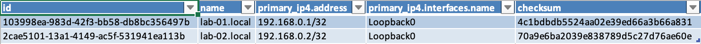

######
Kobold
######

.. contents::

Brief overview
**************
Kobold, in English Goblin, is a miniApp with which you can run playbooks. 
You can use this app to export data or carry out updates.

Let it run
**********

.. code-block:: shell

    usage: run.py [-h] [--config CONFIG] [--loglevel LOGLEVEL] [--loghandler LOGHANDLER] 
                  [--scrapli-loglevel SCRAPLI_LOGLEVEL] [--uuid UUID]
                  [--playbook PLAYBOOK] [--job JOB] [--dry-run] [--profile PROFILE] [--port PORT]

    options:
    -h, --help            show this help message and exit
    --config CONFIG       used config file
    --loglevel LOGLEVEL   used loglevel
    --loghandler LOGHANDLER
                            used log handler
    --scrapli-loglevel SCRAPLI_LOGLEVEL
                            Scrapli loglevel
    --uuid UUID           database logging uuid
    --playbook PLAYBOOK   run playbook
    --job JOB             run job(s) in playboook
    --dry-run             just print what todo on what device or interface
    --profile PROFILE
    --port PORT           TCP Port to connect to device

General structure of a Playbook
*******************************

Playbooks configure what to do. A 'job' always consists of:

    - a name
    - a short description
    - an 'SQL' statement that is used to configure which devices the job affects and ...
    - a task that specifies what exactly is to be done.

Examples
********

Here are some examples:

Export device properties
========================
To change the name and/or the primary IP address of several devices, which all have the 
ending .local, these should first be exported. This can be done using the following task.

.. code-block:: yaml

      - job: export_properties
        description: export properties
        devices:
          sql:
            select: id, name, primary_ip4
            from: nb.devices
            where: name__ic=local
        tasks:
          - export: 
            - content: properties
              header: True
              columns: id, name, primary_ip4.address, primary_ip4.interfaces.name, checksum
              format: excel
              filename: ./export/properties.xlsx

You start the job by:

.. code-block:: shell

    ./run.sh --playbook playbooks/playbook.yaml --job export_properties

    2024-01-31 23:18:04 | INFO | starting job export_properties / export properties
    2024-01-31 23:18:04 | INFO | exporting [{'content': 'properties', 'header': True, 'columns': 'id, name, primary_ip4.address, primary_ip4.interfaces.name, checksum', 'format': 'excel', 'filename': './export/properties.xlsx'}]
    2024-01-31 23:18:04 | INFO | exp properties | exporting data as EXCEL to ./export/properties.xlsx

The Excel table created by this job looks like this.

You can then use your favorite software (e.g. libreoffice) to modify the data of the devices 
and read it in again with the miniApp ./updater.py.

Export HLDM
===========

.. code-block:: yaml

    - job: export_hldm
      description: export HLDM
      devices:
        sql:
          select: name
          from: nb.devices
          where: name=lab.local
      tasks:
        - export: 
          - content: hldm
            directory: hldm/__location.name__
            filename: __name__.json

You start the job by:

.. code-block:: shell

    ./run.py --profile default --playbook playbooks/playbook.yaml --job export_hldm --loglevel info

    2024-02-02 14:15:15 | INFO  | unset  | starting job export_hldm / export HLDM
    2024-02-02 14:15:15 | INFO  | unset  | exporting [{'content': 'hldm', 'directory': 'hldm/__cf_net__/__location.name__', 'filename': '__name__.json'}]
    2024-02-02 14:15:16 | INFO  | unset  | creating missing directory hldm/my_Network/site_1

Example playbook
****************

.. code-block:: yaml

    ---
    globals:
      import: ./import
    jobs:
      - job: device_tags
        description: set device tag
        devices:
          sql:
            select: name
            from: nb.devices
            where: location=default-site and name__ic=local
        tasks:
          - set_tag:
            scope: dcim.device
            tag: test

      - job: interface_tags
        description: set interface tag
        devices:
          sql:
            select: name, interfaces
            from: nb.devices
            where: name__ic=local and interfaces_name__ic=GigabitEthernet
        tasks:
          - delete_tag:
            scope: dcim.interface
            tag: dhcp

      - job: device_cf_field
        description: set custom field on device
        devices:
          sql:
            select: name, interfaces
            from: nb.devices
            where: name=eins.local
        tasks:
          - custom_field:
            - net: eins
              scope: dcim.device

      - job: interface_cf_field
        description: set interface custom field
        devices:
          sql:
            select: name, interfaces
            from: nb.devices
            where: name__ic=local and interfaces_name__ic=GigabitEthernet
        tasks:
          - custom_field:
            - iface_field: test
              scope: dcim.interface

      - job: update_device
        description: update device
        devices:
          sql:
            select: name, interfaces
            from: nb.devices
            where: name=eins.local
        tasks:
          - update_device:
            serial: 12345

      - job: update_interface
        description: update interface
        devices:
          sql:
            select: name, interfaces
            from: nb.devices
            where: name__ic=local and interfaces_name__ic=GigabitEthernet
        tasks:
          - update_interface:
            description: mydescr

      - job: export_properties
        description: export properties
        devices:
          sql:
            # the values of the select statement must correspond to the coluns you
            # want to export
            select: id, name, primary_ip4, interfaces, location, cf_net, cf_select
            from: nb.devices
            where: name__ic=local
        tasks:
          - export: 
            - content: properties
              header: True
              columns: id, name, primary_ip4.address, primary_ip4.interfaces.name, checksum
              # columns: name, primary_ip4.address, interfaces.name, interfaces.ip_addresses.address, checksum
              # columns: interfaces.name, interfaces.description
              # columns: id, name, location.name, cf_net,cf_select, checksum
              # columns: name, interfaces.id, interfaces.name, interfaces.description,checksum
              format: excel
              # If you export a CSV file, you can configure delimiter, quotechar, and quoting
              # delimiter: ","
              # quotechar: "|"
              # quoting: minimal
              filename: ./export/properties.xlsx

      - job: export_config
        description: export configs, facts and properties
        devices:
          sql:
            select: id, name, platform, primary_ip4
            from: nb.devices
            where: name=lab.local
        tasks:
          - export: 
            # content can be either config, facts, hldm or properties
            - content: config, facts
              directory: configs
              filename: __name__.json

      - job: export_hldm
        description: export HLDM
        devices:
          sql:
            select: name,cf_net,location
            from: nb.devices
            where: name=lab.local
        tasks:
        - export: 
            # content can be either config, facts, hldm or properties
            - content: hldm
              directory: hldm/__cf_net__/__location_name__
              filename: __name__.json
