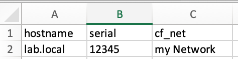
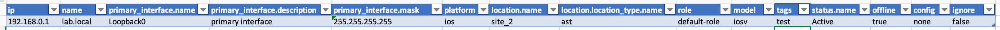

##########
Onboarding
##########

.. contents::

Brief overview
**************
Using the onboarding app, you can onboard devices to nautobot fully automatically. 
There are different ways to define the “inventory” to onboard. If you want to add 
several devices - for example if you want to migrate from a commercial solution to an 
open source based one - an Excel, a CSV or a YAML file can be used. If you just want 
to add a single device, you can also start the onboarding process for a single device 
using the --device ip_address parameter.

Basic Configuration
*******************
Before using the onboarding app, you have to configure it. veritas tries to find the onboarding.yaml 
config file in this order:

  1. user specified file (use --config when starting onboarding)
  2. config in home directory (~/.veritas/miniapps/onboarding/onboarding.yaml)
  3. config in local directory
  4. config in local ./conf/ directory
  5. config in /etc/veritas/ (/etc/veritas/miniapps/onboarding/onboarding.yaml)

Once it finds a configuration, the app reads the config and doesn't look any further.

onboarding.yaml
===============
At least you have to configure the sot (how to access nautobot), logging and where to find additional configs.

nautobot access
---------------
To access nautobot you have to configure the URL, the token and - if you want to - enable ssl_verify

.. code-block:: yaml

    sot:
      nautobot: __nautobot_url__
      token: __nautobot_token__
      ssl_verify: __nautobot_ssl_verify__

logging
-------

.. code-block:: yaml

    general:
      logging:
        loglevel: info
        log_uuid_to: __logging_uuid_to__
        log_to_database: __logging_to_database__
        log_to_rabbitmq: __logging_to_rabbitmq__
        log_to_zeromq: __logging_to_zeromq__
        database:
          host: __logging_database_host__
          database: __logging_database_database__
          user: __logging_database_username__
          password: __logging_database_password__
          port: __logging_database_port__
        rabbitmq:
          host: __logging_rabbitmq_host__
          port: __logging_rabbitmq_port__
        zeromq:
          protocol: __logging_zeromq_protocol__
          host: __logging_zeromq_host__
          port: __logging_zeromq_port__

default values
--------------

You can specify default values for each device (or a range of devices using IP prefixes).
You need to configure where to find the default values list file.

.. code-block:: yaml
    
    defaults:
      repo: __DEFAULTS_REPO__
      path: __DEFAULTS_PATH__
      filename: __DEFAULTS_FILENAME__

Further configurations are stored in our miniApp configuration directory. You need to configure
where to find these configs.

.. code-block:: yaml

    app_configs:
      repo: __CONFIGS_REPO__
      path: __CONFIGS_PATH__

onboarding default values
-------------------------
When onboarding a device the app tries to determine the 'primary' interface. This does not 
necessarily have to be the interface you used to log in. You can configure a list of 
interfaces used by the app to determine the primary interface. It is important to note that 
the order of the list is important.

.. code-block:: yaml

    onboarding:
      defaults:
        # the default primary interface we use to get the primary address
        # the order is important
        interface: __onboarding_default_interfaces__

Where do the app find the mapping? The mapping is used to map 'inventory'-columns to nautobot columns.

.. code-block:: yaml

    mappings:
      # loading mapping from app config (see above)
      inventory:
        filename: inventory_mapping.yaml

If the inventory is a csv file you can configure how to read the content.

.. code-block:: yaml

  inventory:
    csv:
      delimiter: ","
      quotechar: "|"
      quoting: minimal
      newline: ''

offline onboarding
^^^^^^^^^^^^^^^^^^
It is not always possible to login to a device. Onboarding still requires some default values, 
which can be set in the 'offline_config' section. The devices are imported using these values.

.. code-block:: yaml

    offline_config:
      model: unknown
      serial: offline
      platform: ios
      primary_interface: Loopback100
      primary_mask: 255.255.255.255
      primary_description: Primary
      filename: ./conf/offline.conf

.. _miniApp config:

miniApp config
==============
In order to set further properties of the device during onboarding, several configurations are 
read and processed.

Typically the structure of a directory tree looks something like this:

.. code-block:: yaml

    ~user/.veritas/miniapps/onboarding/
      ./additional_values/
      ./config_context/
      ./mappings/
      ./tags

additional values
-----------------
To add additional values add YAML-based configs to this directory. The onboarding app loads 
these files and adds additional values.

Take a look at `add additional values`_ to find out what the exact configuration looks like.

mappings
--------
If an Excel sheet is used as inventory, it may be that the column names do not match the names that need 
to be used in nautobot. For this reason a mapping can be configured. The mapping is explained below. This
config is about where to find the mapping file.

.. code-block:: yaml

  mappings:
    # loading mapping from app config (see above)
    inventory:
      filename: inventory.yaml

tags
----

xxxx

profile.yaml
============
To login to your device you need either a username and password or a public key. This data is stored in a profile.
You can save your profile in your personal directory (./veritas/miniapps/onboarding/profile.yaml).

.. code-block:: yaml

    ---
    profiles:
      default:
        # username to login to devices
        username: your_username
        # encrypted and base64 encoded password
        password: xxxxxxx==
      keylogin:
        username: your_username
        # the SSH key to use
        ssh_key: _path_to_your_key_
        # encrypted and base64 encoded passphrase
        ssh_key_passphrase: _your_encrypted_sshkey_password_

.. note::
  'default' and 'keylogin' are both names that are used to identify the login!

salt.yaml
=========

To decrpt your password, we need the encryption key, mthe salt and the iterations. These values are configured in
./veritas/miniapps/onboarding/salt.yaml

.. code-block:: yaml

    ---
    crypto:
      encryptionkey: your_secret_encryption_key
      salt: your_secret_salt
      iterations: 400000

.. note::

    Do not use this method for your production system. The salt is used to encryot the password and the sshkey passphrase!

How to migrate
**************

1. Creating the inventory using your legacy system
2. Adjusting the inventory
3. Setting the default values
4. Adjusting the additional values - additional values (optional)
5. Customize the Business Logic (Optional)
6. Export and save the configurations (optional)
7. Import the new data

In order to migrate your data to nautobot, the inventory of your legacy system must be exported. 
General instructions how to do this cannot be given here, as this depends on your system. 
However, it is often possible to export the so-called 'custom_properties' and save them as CSV or even Excel.

To onboard devices into Nautobot, we need at least the IP address. All other values such as the location 
or the device type can be used, but do not have to be.

The onboarding process
**********************

First, a brief overview of the order in which the configuration or files are read and processed.

Sequence of processing files and configs
========================================

The onboarding process is as follows:

  1. Read prefix based global default values from REPO (eg. default_values)
  2. Use inventory to set device properties. If a value already exists, it is overwritten. 
     Otherwise the values are added.
  3. The pre-processing business logic is called
  4. Read config files in ./miniapp_configs/onboarding/additional_values/
     If a value already exists, it is overwritten. Otherwise the values are added.
  5. The post-processing business logic is called
  6. After the interface configs were made the post-processing business logic for the
     interfaces is called.
  7. The device is onboarded

Preparing the data
==================
First we have to prepare the inventory data.

Customize the inventory
-----------------------
If you have exported the inventory from the legacy system, it may still need to be customized. This can be done 
with the help of a mapping. There are two main options.

 - modify a column name (key) or
 - modify values

The mapping is configured using a YAML configuration. The directory in which the app looks for the 
configuration is configured in the onboarding.yaml (see above).

The mapping has the following structure:

.. code-block:: yaml

    mappings:
      columns:
        # the format is key in excel/csv => key in nautobot
        my_hostname: name
      values:
        # for each key (eg. name, ip, ...) in your excel/csv you can define new values
        name:
          # if name is old_name and should now be new_name use this 
          old_name: new_name

To customize the column mapping, it must be specified in the 'columns' part. The specified key is the 
'old name' (eg. Excel) of the column and the value is the 'new name'. In the example above, the column 
'my_hostname' is renamed to 'name'.

If you want to modify a value, you use the 'values' part of the config. In the example above, the app
looks at the column 'name' to find the value 'old_name'. If it find the value it is set to 'new_name'.
The column mapping is done first. Then the value mapping is used.

Setting the default values
--------------------------
The onboarding app reads the 'default values' from a file (see config in onboarding.yaml) to gather the 
default values of a device. You can configure the default values as follows:

.. code-block:: yaml

    defaults:
      0.0.0.0/0:
        manufacturer: cisco
        status: Active
        location: {'name': 'default-site'}
        role: default-role
        device_type: default-type
        platform: ios
        custom_fields:
          net: testnet
          test: value
        tags: [ {'name': 'ospf'} ]
      10.0.0.0/8:
        ignore: True
      172.16.0.0/12:
        offline: True
        role: my-role
        device_type: my-type
        platform: ios
      172.16.0.1/32:
        device_type: firewall

.. note::

    To set the default value for a device, the entire hierarchy (beginning from 0.0.0.0/0 to the host IP) of 
    the IP address is traversed. The respective values are overwritten when the hierarchy is run through.

An example: 

If a device with the IP address 172.16.0.1 is onboarded, all values from 0.0.0.0/0 are initially set as the 
default value. The values from the IP network 172.16.0.0/12 are then read and existing values are overwritten. 
In the example above, the device-type for all devices is initially set to 'default-type'. However, devices 
from the range 172.16.0.0/12 receive the device-type 'my-type'. The device 172.16.0.1/32 ultimately receives 
the device type 'firewall'.

.. note::
  
    Devices configured with 'offline: True' will be added as an 'offline' device. Devices with the configuration 
    'ignore: True' will not be imported.

.. _add additional values:

Add additional values (optional)
--------------------------------
You can add any additional values to the device. To do this, you must create a YAML cofig in 
'./additional_values/' (see `miniApp config`_.)

Such a YAML-config looks like:

.. code-block:: yaml

    ---
    # active is either True or False
    active: False
    name: match on hostname
    # platform must match the devices's platform (ios, nxos, ...)
    # use ALL to activate the template for ALL platforms
    platform: all
    # the following list is processed one by one
    additional:
      # the name is just a info for you and does not matter
      - name: first example
        # matches is used to match on certain values 
        # its syntax is source / key / [lookup]
        matches:
          #
          # these are examples you can use
          #
          # facts__fqdn__re: k(?P<digits>\d+)rt
          # facts__hostname__ic: 0815
          facts__fqdn: lab.local
          # config can either be global or interfaces
          # config__global__ic: username lab
          # config__interfaces__ic: ip address
        values:
          #
          # the following values are added to the device properties
          #
          # custom fields can be used as cf_fieldname
          cf_net: is in lab
          # other properties are used by its name
          serial: 123
          # you can use a dot to build a dict
          # eg. to set the location name use location.name
          location.name: default-site

      - name: second example
        mapping: example_mapping.csv
        matches_on:
          # you have to configure 'macthes_on'. 
          # This value is used to find out the device for which the properties should be added.
          # eg device.facts macthes csv.hostname
          - fqdn: hostname
        delimiter: ","
        quotechar: "|"
        quoting: minimal

      - name: third values form xlsx
        # to read a file (Excel or CSV) use the 'file' argument and specify the format of the file
        file: example.xlsx
        format: xlsx
        # you have to configure 'macthes_on'. 
        # This value is used to find out the device for which the properties should be added.
        matches_on:
          # the format is sot_key: excel_key
          # eg. if device.name matches excel.hostname the device is used
          - name: hostname

The first example uses device data (config and device facts like name and IP address) to define criteria 
as to whether or not additional properties should be added to the device.

The second and third example uses a CSV and an Excel file respectively to add additional values. In this case 
the 'matches_on' criteria is mandatory. You must specify which criteria will be used to add data.

The following example should make this clear.

The Excel column is named 'hostname', but Nautobot stores the device name in 'name'. 
In this case 'matches_on' is set to '-name: hostname'

If you look at the image, you will see that for the device lab.local, the serial number is 
overwritten with the value 12345 and the custom field "net" is given the value "my Network".

Customize Business Logic (Optional)
-----------------------------------
By writing a plugin, you can implement your own business logic. Have a look at the plugin directory 
of the app. There you will find three files to serve as examples.

- business_logic_config_context.py
- business_logic_device.py
- business_logic_interface.py

You can implement your own class or just use a single method to modify device data. To tell
the onboarding app to use your business logic use a decorator.

The following example shows how to implement the "Interface Business Logic". 

.. code-block:: python

      from veritas.onboarding import plugins

      class BusinessLogic_Interface(abc_bl_interface.BusinessLogic_Interface):
          def __init__(self, device_properties, configparser):
              logger.debug('initialiting interface business logic object')

          def post_processing(self, interfaces):
              logger.debug('post processing interface business logic')
              return interfaces

      @plugins.interface_business_logic('ios')
      def post_processing(device_properties, configparser):
          return BusinessLogic_Interface(device_properties, configparser)

To implement your "Device Business Logic" use 

.. code-block:: python

      from veritas.onboarding import plugins

      class BusinessLogic_Device(abc_bl_device.BusinessLogic_Device):
          def __init__(self, configparser, device_facts):
              logger.debug('initialiting interface business logic object')

          def pre_processing(sot, device_defaults):
              logger.debug('pre_processing device business logic')
              pass

          def post_processing(sot, device_properties):
              logger.debug('post_processing device business logic')
              pass

      @plugins.device_business_logic('ios')
      def device_business_logic(configparser, device_facts):
          return BusinessLogic_Device(configparser, device_facts)

to implement the "Config Context Business Logic"

.. code-block:: python

      from veritas.onboarding import plugins

      class BusinessLogic_ConfigContext(abc_bl_config_context.BusinessLogic_ConfigContext):
          def __init__(self, device_properties, device_facts, interfaces, configparser):
              logger.debug('initialiting config context business logic object')

          def post_processing(self, config_context):
              logger.debug('post processing config context business logic')

      @plugins.config_context_business_logic('ios')
      def post_processing(device_properties, device_facts, interfaces, configparser):
          return BusinessLogic_ConfigContext(device_properties, device_facts, interfaces, configparser)

.. note::

    Each platform can have its own business logic. The three examples above refer to the "ios" platform.

Onboarding
==========

Export device configurations (optional)
---------------------------------------
Depending on how often you have to run the "onboarding process" to import all devices, you should 
export the configurations of the devices beforehand. This saves time because the app only has to 
read the configurations from the hard disk in this case.

.. tip::

    >>> ./onboarding.py --profile default --loglevel info --inventory inventory.xlsx --export

This command runs through the inventory list and exports the running config as well as the device facts. 

Adding devices to nautobot
--------------------------
There a several options to onboard devices:

Onboarding using a file
^^^^^^^^^^^^^^^^^^^^^^^
The onboarding app supports three different file types:

- Excel (xlsx)
- YAML
- CSV

You can find an example inventory for each of the file type in the ./conf subdirectory. These files can be used as a starting point 
for creating an inventory. The xlsx file looks as follows:

Each row represents a device, each column a property of the device. Parameters that require a 'subparameter', such as

.. tip::

    .. code-block:: yaml

        {'location': {'name': 'my location'}}

are configured using a "dot"-syntax eg. 'location.name'. **The dot is important!**

The YAML file has the following structure:

.. code-block:: yaml

    ---
    inventory:
        - name: lab.local
          ip: 192.168.0.1

Last but not least the CSV file...

.. code-block:: python

    ip,name,location
    192.168.0.1,lab.local,mylocation

Onboarding a single device
^^^^^^^^^^^^^^^^^^^^^^^^^^

Instead of onboarding the complete inventory you can use the parameter '--device IP-Address' to 
start the onboarding process for this device. 

Sarting the onboarding
^^^^^^^^^^^^^^^^^^^^^^
The following output shows the possible arguments of the onboarding app:

.. code-block:: shell

      usage: onboarding.py [-h] [--onboarding] [--primary-only] [--interfaces] [--cables] 
                          [--config-context] [--tags] [--update] [--export] [--show-facts] 
                          [--show-config] [--dry-run] [--config CONFIG] [--loglevel LOGLEVEL] 
                          [--loghandler LOGHANDLER] [--uuid UUID] 
                          [--scrapli-loglevel SCRAPLI_LOGLEVEL] [--device DEVICE] 
                          [--inventory INVENTORY] [--sot SOT] [--import] [--filter FILTER] 
                          [--username USERNAME] [--password PASSWORD] [--profile PROFILE] 
                          [--port PORT] [--defaults DEFAULTS]

      options:
        -h, --help            show this help message and exit
        --onboarding          onboard device to nautobot
        --primary-only        add PRIMARY interface only to nautobot
        --interfaces          add all interfaces to nautobot
        --cables              add cables to nautobot
        --config-context      write config context to repo
        --tags                add device tags to nautobot
        --update              update nautobot even if device exists
        --export              write config and facts to file
        --show-facts          show facts only and exit
        --show-config         show config only and exit
        --dry-run             show key/values but do not onboard
        --config CONFIG       used other config file
        --loglevel LOGLEVEL   used loglevel
        --loghandler LOGHANDLER
                              used log handler
        --uuid UUID           log uuid used for journal
        --scrapli-loglevel SCRAPLI_LOGLEVEL
                              Scrapli loglevel
        --device DEVICE       hostname or IP address of device to onboard
        --inventory INVENTORY
                              read inventory from file (xlsx, csv, yaml)
        --sot SOT             use nautobot to get devicelist
        --import              import config and facts from file
        --filter FILTER       simple filter (hostname includes) to filter inventory
        --username USERNAME   username to connect to devices
        --password PASSWORD   password to use to connect to devices
        --profile PROFILE     profile used to connect to devices
        --port PORT           TCP Port to connect to device
        --defaults DEFAULTS   Use different default file

The most import arguments are:

  - --onboarding
  - --inventory
  - --primary-only
  - --interfaces
  - --tags
  - --profile
  - --export
  - --import

Onboard the inventory (using inventory.xlsx), importing the config from disk and adding the primary interface only:

.. code-block:: python

    >>> ./onboarding.py --loglevel info --inventory inventory.xlsx --import --onboarding --primary-only

Onboard the inventory (using inventory.xlsx) importing the config from disk and adding all interface:

.. code-block:: python

    >>> ./onboarding.py --loglevel info --inventory inventory.xlsx --import --onboarding --iterfaces

.. note::

    If you have not exported the configurations before, you must either specify a profile, 
    specify the username and password as arguments, or enter the username and password after starting.

If you want to add tags to nautobot, add the '--tags' argument to the above command line.

Offline devices
---------------
You can onboard devices to which you do not have access - and cannot download the running config.
To onboard such devices use the inventory and set 'offline' to 'true'. You can either configure your own 
offline config or use 'none'. In this case a minimal coonfig is used to onboard the device.
Of course you can add additional values to configure the devices.

Extending onboarding - The plugin architecture
**********************************************
The onboarding plugin architecture allows you to extend the functionality of the app.

.. list-table:: Onboarding Plugins and Decorators
    :widths: 25 25 40
    :header-rows: 1

    * - Type
      - Decorator
      - Description
    * - device configs and facts
      - @plugins.config_and_facts('platform')
      - Get the device configuration and facts
    * - config parser
      - @plugins.configparser('platform')
      - Get the device configuration parser
    * - offlline importer
      - @plugins.offline_importer
      - Import offline devices
    * - device business logic
      - @plugins.device_business_logic('platform')
      - Modify device properties
    * - interface business logic
      - @plugins.interface_business_logic('platform')
      - Modify interface properties
    * - config context business logic
      - @plugins.config_context_business_logic('platform')
      - Modify config context properties
    * - device properties
      - @plugins.device_properties('platform')
      - Add device properties to the device
    * - interface properties
      - @plugins.interface_properties('platform')
      - Add interface properties to the device

Thera re several abstract classed implemented. You can use these classes to implement your own logic.
The following example illustrates how to implement your own "get config and facts" method.

.. code-block:: python

    from veritas.onboarding import plugins

    @plugins.config_and_facts('linux')
    def get_device_config_and_facts(device_ip, device_defaults, profile, tcp_port=22, scrapli_loglevel='none'):
        logger.debug('your code here')
    
        return device_config, device_facts

To implement your own configuration parser use "@plugins.configparser('platform')". The 'platform' parameter 
reflects the device's platform. Onboarding checks if the configured platform attribute of the device matches 
your parameter.

.. code-block:: python

      from veritas.onboarding import plugins

      class Linux(abstract_configparser.Configparser):

          def __init__(self, config, platform):
              # The configuration was retrieved from the "config_and_facst" plugin.
              self._config = config
              self._platform = platform

              logger.debug('initialized config parser for platform linux')

          def get_interface_ipaddress(self, interface):
              pass

          def get_interface_name_by_address(self, address):
              pass

          def get_interface(self, interface):
              pass

          def find_in_global(self, properties):
              pass

          def find_in_interfaces(self, properties):
              pass

          def get_fqdn(self):
              pass

      @plugins.configparser('linux')
      def get_configparser(config, platform):
          parser = Linux(config=config, platform=platform)
          return parser

Whenever you have another platform you must implement your own logic. Even getting the dveice and interface
properties may vary from platform to platform. So you have to implement your own "device_properties" and 
"interface_properties" method.
